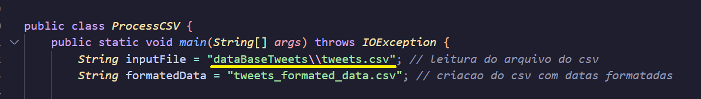

# Projeto LEDA - transformações 

A primeira etapa do projeto da disciplina de Laboratório de Estrutura de Dados tem como objetivo a transformação das datas do arquivo "tweets.csv" criando um novo e nomeado de "tweets_formated_data.csv".

A partir das transformação da data, cria duas novas colunas contendo novas informações e dados sobre elas, armazenado no novo CSV chamado “tweets_mentioned_persons.csv”

## Como rodar o código

1. Clone o repositório: 
Execute no terminal:
``` git clone https://github.com/ellerimx/projetoLEDA-transformacoes.git ```

2. Baixe o arquivo que contém a dataBase no link: [Download do dataBase](https://drive.google.com/drive/u/1/folders/1x3Zxj89-YURgY7_dVkE1ONW_qqfSDNyb)

3. Coloque o arquivo na pasta correta.
Após o download no passo 2, mova o arquivo ``` tweets.csv ``` para a pasta ```dataBaseTweets``` que está no repositório clonado


4. Verifique se o caminho do arquivo no código está correto.

    No Windows: o caminho é separado por duas barras invertidas (como está no código original) 
    
    

4. Verifique se o caminho do arquivo no código está correto.

   No Windows: o caminho é separado por duas barras invertidas (como está no código original) 


   No MacOS ou Linux: modifique o caminho para uma barra normal. Exemplo: ```String inputFile = "dataBaseTweets/tweets.csv"; ```
